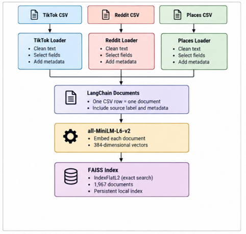
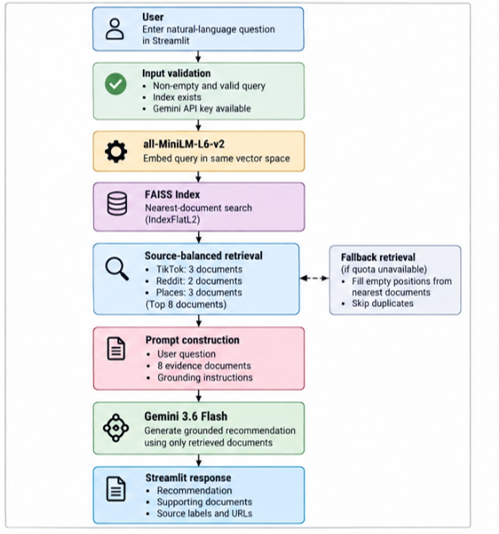

# RestoRec 🍽️

RestoRec is a retrieval-augmented generation (RAG) restaurant recommendation system focused on Croydon and surrounding areas of South London. It combines restaurant information collected from TikTok, Reddit and Google Places-style data to provide grounded restaurant recommendations through a Streamlit interface.

Rather than relying only on the general knowledge of a large language model, RestoRec retrieves relevant records from a local knowledge base before generating an answer. This helps the application produce recommendations based on the supplied datasets.

## Project overview

The application follows a traditional RAG pipeline:

1. Restaurant records are loaded from CSV files.
2. Each record is converted into a LangChain `Document`.
3. Text is encoded using the `all-MiniLM-L6-v2` sentence-transformer model.
4. Embeddings are stored in a local FAISS vector index.
5. A user enters a restaurant-related question through Streamlit.
6. The most relevant documents are retrieved from the knowledge base.
7. The retrieved context is supplied to Google Gemini.
8. Gemini generates an answer grounded in the retrieved records.


## System architecture




The retrieval evaluation operates separately from answer generation. This makes it possible to compare retrieval methods without the results being affected by the language model.

## Technology stack

| Technology | Purpose |
|---|---|
| Python | Core application and evaluation language |
| Streamlit | Web application interface |
| LangChain | Document, retrieval and RAG pipeline components |
| Sentence Transformers | Creation of semantic document and query embeddings |
| `all-MiniLM-L6-v2` | Sentence-embedding model |
| FAISS | Local vector similarity search |
| BM25 | Lexical keyword-based retrieval baseline |
| Reciprocal Rank Fusion | Combination of dense and BM25 rankings |
| Google Gemini | Context-grounded answer generation |
| Python CSV module | Reading and processing the TikTok, Reddit and Places datasets |
| pytest | Automated testing |
| python-dotenv | Loading API credentials from `.env` |

## Project structure

```text
RestoRec/
├── data/
│   ├── tiktok.csv
│   ├── reddit.csv
│   └── places.csv
│
├── evaluation/
│   ├── evaluation.py
│   ├── matched_comparison.py
│   ├── labelling_output.txt
│   └── retrieval_evaluation_results.csv
│
├── FAISS_index/
│   └── Generated local vector index
│
├── src/
│   ├── main.py
│   └── rag.py
│
├── tests/
│   ├── test_embedding_and_faiss.py
│   ├── test_functional_smoke.py
│   ├── test_llm_context.py
│   ├── test_query_behaviour.py
│   └── test_rag.py
│
├── .env
├── .gitignore
├── pytest.ini
├── requirements.txt
└── README.md
```

### Directory descriptions

#### `data/`

Contains the three source datasets:

- `tiktok.csv` contains TikTok captions, hashtags, engagement information and associated place details.
- `reddit.csv` contains restaurant-related Reddit posts and metadata.
- `places.csv` contains structured restaurant details such as name, category, address, rating, atmosphere and dietary options.

#### `src/`

Contains the main application code:

- `main.py` defines the Streamlit interface and calls the RAG functions.
- `rag.py` loads the datasets, constructs documents, creates or loads the FAISS index, retrieves relevant context and communicates with Gemini.

#### `evaluation/`

Contains the retrieval evaluation framework:

- `evaluation.py` defines the evaluation questions, relevance labels, retrieval methods and metric calculations.
- `matched_comparison.py` controls for the dense fallback and recomputes the metrics on the 14 matched queries.
- `labelling_output.txt` records candidate documents used during manual relevance assessment.
- `retrieval_evaluation_results.csv` contains the final results for dense, BM25 and hybrid retrieval.

#### `tests/`

Contains automated tests covering document loading, embeddings, FAISS retrieval, query behaviour, context construction and basic application functionality.

#### `FAISS_index/`

Contains the locally generated vector database. This directory is generated by the application and should normally be excluded from Git because it can be recreated from the source datasets.

## Installation

### 1. Clone the repository

```powershell
git clone <https://github.com/MB-C0des/RestoRec>
cd RestoRec
```


### 2. Create a virtual environment

Python 3.12 is recommended.

```powershell
py -3.12 -m venv .venv
```

Activate the environment:

```powershell
.\.venv\Scripts\Activate.ps1
```

When the environment is active, `(.venv)` should appear at the beginning of the PowerShell prompt.

If PowerShell prevents activation, run:

```powershell
Set-ExecutionPolicy -Scope Process -ExecutionPolicy Bypass
.\.venv\Scripts\Activate.ps1
```

### 3. Install the dependencies

```powershell
python -m pip install --upgrade pip
pip install -r requirements.txt
```

The main dependencies include:

```text
streamlit
python-dotenv
langchain
langchain-community
langchain-google-genai
langchain-huggingface
sentence-transformers
faiss-cpu
rank-bm25
pytest
```

The exact installed dependencies should be maintained in `requirements.txt`.

### 4. Configure the Gemini API key

Create a `.env` file in the project root:

```env
GOOGLE_API_KEY=your_google_api_key
```

The `.env` file contains a secret and must not be committed to Git. Confirm that `.gitignore` contains:

```gitignore
.env
.venv/
__pycache__/
*.py[cod]
.pytest_cache/
FAISS_index/
```

### 5. Add the datasets

Place the source files inside the `data` directory:

```text
data/
├── tiktok.csv
├── reddit.csv
└── places.csv
```

The filenames must match those expected by `src/rag.py`. The application will raise a `FileNotFoundError` if a required file cannot be found.

## Running the application

Run Streamlit from the project root:

```powershell
streamlit run .\src\main.py
```

Streamlit should open the application in a browser. If it does not open automatically, use the local address shown in the terminal, normally:

```text
http://localhost:8501
```

Create the knowledge base before submitting a question. During initial creation, the embedding model may need to be downloaded and all documents must be encoded. Therefore, the first execution may take longer than later runs.

Example questions include:

```text
Where can I find Indian food in Croydon?
```

```text
Where can I get sushi in Purley?
```

```text
Which restaurants have vegan options near East Croydon station?
```

The application can also display the retrieved records so that the evidence supplied to Gemini can be inspected.

## Running the tests

Run the complete test suite from the project root:

```powershell
python -m pytest
```

For more detailed output:

```powershell
python -m pytest -v
```

Run a specific test file:

```powershell
python -m pytest .\tests\test_rag.py -v
```

The tests cover:

- CSV loading and document construction.
- Embedding generation.
- FAISS index creation and retrieval.
- Source metadata.
- Query-specific retrieval behaviour.
- LLM context construction.
- Functional smoke testing.


## Retrieval evaluation

Run the evaluation from the project root:

```powershell
python -u .\evaluation\evaluation.py
```

To display the results and save the complete terminal output:

```powershell
python -u .\evaluation\evaluation.py 2>&1 |
    Tee-Object -FilePath .\evaluation\evaluation_output.txt
```

If a dependency warning needs to be suppressed:

```powershell
python -W ignore::DeprecationWarning -u .\evaluation\evaluation.py 2>&1 |
    Tee-Object -FilePath .\evaluation\evaluation_output.txt
```

### Manual labelling mode

The evaluation questions contain sets of manually verified relevant document IDs. During benchmark construction, labelling mode can be enabled to print candidate documents:

```python
LABELLING_MODE = True
```

After the relevance labels have been added, change it to:

```python
LABELLING_MODE = False
```

The evaluation will then run the three retrieval methods and calculate their metrics.

### Evaluation metrics

- **Precision@8** measures how many of the eight retrieved documents are relevant.
- **Recall@8** measures how many of all known relevant documents are retrieved.
- **MRR** measures the rank of the first relevant document.
- **nDCG@8** rewards relevant documents that appear nearer the top of the ranking.
- **Time (ms)** measures average retrieval latency.

### Current results

Retrieval Results for All 20 Queries

| Method | Precision@8 | Recall@8 | MRR | nDCG@8 | Mean Retrieval Time (ms) |
|---|---:|---:|---:|---:|---:|
| **Dense** | 0.225 | 0.273 | 0.263 | 0.258 | 75.56 |
| **BM25** | 0.119 | 0.185 | 0.136 | 0.153 | 8.42 |
| **Hybrid** | 0.206 | 0.263 | 0.249 | 0.237 | 96.57 |

Retrieval Results for 14 Matched Queries

| Method | Precision@8 | Recall@8 | MRR | nDCG@8 |
|---|---:|---:|---:|---:|
| **Dense** | 0.179 | 0.348 | 0.186 | 0.236 |
| **BM25** | 0.116 | 0.256 | 0.159 | 0.179 |
| **Hybrid** | 0.188 | 0.348 | 0.184 | 0.238 |	

Dense retrieval has a fallback that BM25 and hybrid retrieval lack. In six queries it replaced missing TikTok or Reddit documents with extra Places documents, which gave dense retrieval an advantage. The matched rows exclude those six queries, so all three methods are compared on the same source mix. To reproduce them, run the evaluation first, then:

```powershell
python -u .\evaluation\matched_comparison.py
```
The script reports the source mix returned by each method, lists the affected queries and recomputes every metric on the 14 matched queries.

### Key findings
Dense and hybrid retrieval performed comparably on the matched queries, and both outperformed BM25. Dense retrieval's overall lead came from its fallback. RestoRec deploys dense retrieval for its simplicity and speed.
BM25 uses whitespace tokenisation without lowercasing, so a token like Croydon? matches nothing. This explains most of its weakness.
Results are grouped by source in the order TikTok, Reddit, Places. Since almost every relevant document is a Places record, MRR and nDCG@8 largely reflect this order. Precision@8 and Recall@8 give the fairer comparison.

## Future improvements
Allocate retrieval slots by query need, or re-rank candidates across sources.
Add metadata filters for location and dietary requirements.
Fix BM25 tokenisation and tune the hybrid weights on a development set.
Evaluate generated answers for faithfulness.
Add controlled multi-turn memory.


